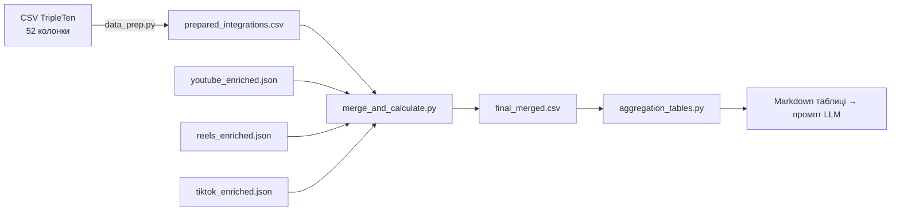

# Довідник методології: Таблиці агрегації у звіті

> Цей документ пояснює, як обчислюється кожна таблиця в кінцевому аналітичному звіті.
> Всі таблиці генеруються кодом (pandas) з файлу `final_merged.csv` і вставляються як
> пре-обчислені дані в промпт LLM, щоб запобігти галюцинаціям.

---

## Глосарій ключових понять

| Термін | Визначення |
|---|---|
| **has_purchases** | Boolean-прапорець: `True` якщо `Purchase F - TOTAL > 0` (рядок 78–80 `merge_and_calculate.py`) |
| **Winners** | Інтеграції з `has_purchases == True` |
| **Losers** | Інтеграції з `has_purchases == False` |
| **Purchase Rate** | `кількість_winners / загальна_кількість` — частка інтеграцій, що згенерували хоча б 1 покупку |
| **Avg CPP** | Average Cost Per Purchase — `сума_бюджетів_winners / загальна_кількість_покупок` |
| **Enrichment-поля** | Результати LLM-аналізу відео/рілсів, зберігаються як `enrichment_*` колонки після злиття |
| **Score-колонки** | 8 числових оцінок від LLM (1–10): authenticity, storytelling, emotional_appeal, urgency, specificity, benefit_clarity, humor, professionalism |

---

## Процес підготовки даних

1. **data_prep.py** — зчитує CSV з `;`-роздільником, конвертує дати, нормалізує числа (кома → крапка), класифікує URL-адреси
2. **merge_and_calculate.py** — зливає `prepared_integrations.csv` з enriched JSON, обчислює метрики воронки та `has_purchases`
3. **aggregation_tables.py** — генерує 11 markdown-таблиць із pandas
4. **textual_aggregation_tables.py** — генерує 4 текстові таблиці з даних textual-аналізу

---

## Обчислювані метрики (merge_and_calculate.py)

Перед побудовою таблиць, `calculate_metrics()` додає наступні розрахункові колонки:

| Метрика | Формула |
|---|---|
| `cost_per_view` | `Budget / Fact Reach` |
| `cost_per_contact` | `Budget / Contacts Fact` |
| `cost_per_deal` | `Budget / Deals Fact` |
| `cost_per_purchase` | `Budget / Purchase F - TOTAL` |
| `traffic_to_contact_rate` | `Contacts Fact / Traffic Fact` |
| `contact_to_deal_rate` | `Deals Fact / Contacts Fact` |
| `deal_to_call_rate` | `Calls Fact / Deals Fact` |
| `call_to_purchase_rate` | `Purchase F - TOTAL / Calls Fact` |
| `full_funnel_conversion` | `Purchase F - TOTAL / Fact Reach` |
| `has_purchases` | `True` якщо `Purchase F - TOTAL > 0` |
| `engagement_rate` | `(like_count + comment_count) / view_count` (YouTube only) |

> Ділення на нуль та NaN-значення повертають `None`.

---

## Таблиці основного звіту (aggregation_tables.py)

### Таблиця 1.1 — Score Comparison (YouTube only)

**Функція:** `compute_score_comparison()`
**Файл:** [aggregation_tables.py](file:///c:/Users/olehr/Projects/TripleTen/tripleten-analyzer/src/analysis/aggregation_tables.py#L67-L105)

**Що рахує:** Середні оцінки контенту (8 score-колонок) для YouTube-інтеграцій, розділених на дві групи.

**Методологія:**
1. Фільтрує лише рядки `Format == "youtube"` (case-insensitive)
2. З них — лише ті, що мають хоча б одне ненульове score-значення (`notna().any(axis=1)`)
3. Ділить на групи: `has_purchases == True` та `has_purchases == False`
4. Для кожної score-колонки обчислює `mean()` для кожної групи
5. `Gap` = `mean(winners) - mean(losers)`

**Колонки таблиці:** Metric | With Purchases | Without Purchases | Gap

> **Увага:** враховуються лише YouTube-інтеграції, у яких є хоча б одна оцінка. Інтеграції без enrichment-даних виключені.

---

### Таблиця 1.2 — Offer Type Distribution

**Функція:** `compute_offer_type_distribution()`
**Файл:** [aggregation_tables.py](file:///c:/Users/olehr/Projects/TripleTen/tripleten-analyzer/src/analysis/aggregation_tables.py#L108-L134)

**Що рахує:** Розподіл типів пропозицій (offer_type) серед інтеграцій з покупками та без.

**Методологія:**
1. Використовує колонку `enrichment_offer_type`
2. Фільтрує рядки, де offer_type не пустий та не NaN
3. Для кожного унікального типу рахує кількість winners та losers
4. **Purchase Rate** = `count(winners) / count(total)` для кожного типу

**Колонки:** Offer Type | With Purchases | Without Purchases | Total | Purchase Rate

---

### Таблиця 1.3 — Overall Tone Analysis

**Функція:** `compute_tone_analysis()`
**Файл:** [aggregation_tables.py](file:///c:/Users/olehr/Projects/TripleTen/tripleten-analyzer/src/analysis/aggregation_tables.py#L137-L172)

**Що рахує:** Загальний тон інтеграції vs purchase rate.

**Методологія:**
1. Використовує колонку `enrichment_overall_tone`
2. Рядки з даними — групує по тонах, рахує winners/losers
3. Рядки **без** даних (NaN або порожнє) — виділяє окремою групою "N/A (no data)"
4. **Purchase Rate** = `count(winners) / total` для кожного тону

**Колонки:** Tone | With Purchases | Without Purchases | Total | Purchase Rate

---

### Таблиця 1.4 — Personal Story Correlation

**Функція:** `compute_personal_story_correlation()`
**Файл:** [aggregation_tables.py](file:///c:/Users/olehr/Projects/TripleTen/tripleten-analyzer/src/analysis/aggregation_tables.py#L175-L200)

**Що рахує:** Чи присутність особистої історії корелює з покупками.

**Методологія:**
1. Використовує колонку `enrichment_has_personal_story`
2. Порівнює значення як рядки (`str(x).lower()`) для сумісності з boolean та string-форматами
3. Для двох груп (Yes / No) рахує winners та losers
4. **Purchase Rate** = `count(winners) / total`

**Колонки:** Has Personal Story | With Purchases | Without Purchases | Total | Purchase Rate

---

### Таблиця 1.5 — Integration Position

**Функція:** `compute_integration_position()`
**Файл:** [aggregation_tables.py](file:///c:/Users/olehr/Projects/TripleTen/tripleten-analyzer/src/analysis/aggregation_tables.py#L203-L228)

**Що рахує:** Позиція рекламної інтеграції у відео vs purchase rate.

**Методологія:**
1. Використовує колонку `enrichment_integration_position`
2. Фільтрує лише рядки з ненульовою позицією
3. Для кожної унікальної позиції — кількість winners/losers
4. **Purchase Rate** = `count(winners) / total`

**Колонки:** Position | With Purchases | Without Purchases | Total | Purchase Rate

---

### Таблиця 2.1 — Funnel Conversion Rates

**Функція:** `compute_funnel_conversion_rates()`
**Файл:** [aggregation_tables.py](file:///c:/Users/olehr/Projects/TripleTen/tripleten-analyzer/src/analysis/aggregation_tables.py#L231-L268)

**Що рахує:** Поетапні конверсії маркетингової воронки.

**Етапи воронки:**

| Етап | Чисельник | Знаменник |
|---|---|---|
| Reach → Traffic | Traffic Fact | Fact Reach |
| Traffic → Contacts | Contacts Fact | Traffic Fact |
| Contacts → Deals | Deals Fact | Contacts Fact |
| Deals → Calls | Calls Fact | Deals Fact |
| Calls → Purchase | Purchase F - TOTAL | Calls Fact |

**Методологія:**
1. Для кожного етапу: фільтрує лише рядки де `denominator > 0`
2. Обчислює rate по кожному рядку: `numerator / denominator`
3. **Median** — медіана по всіх рядках (стійка до викидів)
4. **Mean** — середнє арифметичне
5. **Non-zero Count** — `count(rate > 0) / count(total рядків з denominator > 0)`

**Колонки:** Funnel Stage | Median | Mean | Non-zero Count

> **Важливо:** рядки з `denominator == 0` або NaN **виключаються**, щоб не спотворювати розрахунок.

---

### Таблиця 3.1 — Platform Performance Summary

**Функція:** `compute_platform_performance()`
**Файл:** [aggregation_tables.py](file:///c:/Users/olehr/Projects/TripleTen/tripleten-analyzer/src/analysis/aggregation_tables.py#L271-L302)

**Що рахує:** Зведена таблиця ефективності по платформах (YouTube, Instagram Reels, TikTok тощо).

**Методологія:**
1. Групує по `Format` (lowercase)
2. **Count** — кількість інтеграцій на платформі
3. **Total Budget** — `sum(Budget)` для всіх інтеграцій платформи
4. **Integrations w/ Purchases** — кількість winners
5. **Total Purchases** — `sum(Purchase F - TOTAL)` (NaN → 0)
6. **Purchase Rate** — `count(winners) / count(total)`
7. **Avg CPP** — `sum(Budget серед winners) / sum(Purchase F - TOTAL серед всіх)` — тобто загальний бюджет переможців поділений на загальну кількість покупок

**Колонки:** Platform | Count | Total Budget | Integrations w/ Purchases | Total Purchases | Purchase Rate | Avg CPP (among winners)

> **Нюанс Avg CPP:** бере суму бюджетів **лише переможців** (не всієї платформи) і ділить на total purchases всієї платформи. Це показує середню вартість покупки серед тих, хто вже генерує продажі.

---

### Таблиця 4.1 — Niche Performance

**Функція:** `compute_niche_performance()`
**Файл:** [aggregation_tables.py](file:///c:/Users/olehr/Projects/TripleTen/tripleten-analyzer/src/analysis/aggregation_tables.py#L335-L370)

**Що рахує:** Ефективність по нішах (тематиках).

**Методологія:**
1. Групує по колонці `Topic`
2. **Відсіює ніші з менше ніж 2 інтеграціями** (для статистичної значимості)
3. Для кожної ніші рахує ті ж метрики, що й для платформ (count, budget, winners, purchases, rate, CPP)
4. **Avg CPP** = `sum(Budget winners) / sum(purchases)` — лише серед інтеграцій з покупками

**Колонки:** Niche | Count | Total Budget | Integrations w/ Purchases | Total Purchases | Purchase Rate | Avg CPP

---

### Таблиця 5.1 — Budget Tier Performance

**Функція:** `compute_budget_tiers()`
**Файл:** [aggregation_tables.py](file:///c:/Users/olehr/Projects/TripleTen/tripleten-analyzer/src/analysis/aggregation_tables.py#L305-L332)

**Що рахує:** Ефективність по бюджетних категоріях.

**Бюджетні тіри (визначені на рядках 27–33):**

| Тір | Діапазон |
|---|---|
| $0–$1,000 | Budget від 0 до 1000 |
| $1,001–$3,000 | Budget від 1001 до 3000 |
| $3,001–$5,000 | Budget від 3001 до 5000 |
| $5,001–$8,000 | Budget від 5001 до 8000 |
| $8,001+ | Budget від 8001 до ∞ |

**Методологія:**
1. Кожна інтеграція потрапляє в тір на основі значення `Budget` (включно з межами: `>=lo AND <=hi`)
2. Рахує count, winners, total purchases, rate, CPP — аналогічно до таблиці 3.1

**Колонки:** Budget Tier | Count | Integrations w/ Purchases | Total Purchases | Purchase Rate | Avg CPP

---

### Таблиця 6.1 — Manager Performance

**Функція:** `compute_manager_performance()`
**Файл:** [aggregation_tables.py](file:///c:/Users/olehr/Projects/TripleTen/tripleten-analyzer/src/analysis/aggregation_tables.py#L373-L402)

**Що рахує:** Порівняння ефективності менеджерів.

**Методологія:**
1. Групує по колонці `Manager` (пропускає NaN)
2. Для кожного менеджера обчислює ті ж метрики: count, total budget, winners, purchases, rate, CPP
3. **Avg CPP** = `sum(Budget winners-менеджера) / sum(purchases менеджера)`

**Колонки:** Manager | Count | Total Budget | Integrations w/ Purchases | Total Purchases | Purchase Rate | Avg CPP

---

### Таблиця 8.1 — Anomalies

**Функція:** `compute_anomaly_summary()`
**Файл:** [aggregation_tables.py](file:///c:/Users/olehr/Projects/TripleTen/tripleten-analyzer/src/analysis/aggregation_tables.py#L405-L457)

**Що рахує:** Незвичайні патерни в даних. Це не таблиця, а **список аномалій** з трьох категорій.

**Категорії аномалій:**

| Аномалія | Критерій |
|---|---|
| High reach, near-zero traffic | `Fact Reach > 10,000` AND `Traffic Fact < 100` |
| Low budget with purchases | `Budget < $2,000` AND `has_purchases == True` |
| High budget, zero purchases | `Budget > $5,000` AND `has_purchases == False` |

**Формат:** для кожної категорії виводиться кількість інтеграцій та список конкретних прикладів (до 5 для high-reach, всі для low-budget winners, до 10 для high-budget losers) з деталями: ім'я, формат, reach, traffic, budget, purchases, CPP.

---

## Таблиці текстуального звіту (textual_aggregation_tables.py)

Ці таблиці побудовані на основі `textual_correlation.py`, яка порівнює текстуальні характеристики переможців та програвших.

### Таблиця T1 — Text Statistics Comparison

**Функція:** `compute_text_stats_comparison()`
**Файл:** [textual_aggregation_tables.py](file:///c:/Users/olehr/Projects/TripleTen/tripleten-analyzer/src/analysis/textual_aggregation_tables.py#L40-L77)

**Що рахує:** Середні статистики тексту для інтеграцій з/без покупок.

**Методологія:**
1. Дані беруться з `build_textual_comparison()`, яка зчитує `enrichment.textual.text_stats`
2. Для кожної групи (winners/losers) підсумовує та обчислює середнє `text_stats` метрик
3. **Gap** = `winners_value - losers_value`

**Метрики:**
- Avg Word Count (середня кількість слів)
- Avg Sentence Count
- Avg Question Count
- Avg Exclamation Count
- Avg First Person (I/my/me)
- Avg Second Person (you/your)
- Avg Product Mentions

**Колонки:** Metric | With Purchases | Without Purchases | Gap

---

### Таблиця T2 — Opening Pattern Distribution

**Функція:** `compute_opening_pattern_rates()`
**Файл:** [textual_aggregation_tables.py](file:///c:/Users/olehr/Projects/TripleTen/tripleten-analyzer/src/analysis/textual_aggregation_tables.py#L80-L100)

**Що рахує:** Розподіл типів відкриття (hook-типів) серед winners та losers.

**Методологія:**
1. З `enrichment.textual.opening_pattern.opening_type` кожної інтеграції
2. Підраховує Counter по типах для кожної групи
3. Виводить абсолютну кількість для кожного типу

**Колонки:** Opening Type | With Purchases | Without Purchases | Total

---

### Таблиця T3 — Closing Pattern Distribution

**Функція:** `compute_closing_pattern_rates()`
**Файл:** [textual_aggregation_tables.py](file:///c:/Users/olehr/Projects/TripleTen/tripleten-analyzer/src/analysis/textual_aggregation_tables.py#L103-L122)

**Що рахує:** Розподіл типів закриття (closing patterns) серед winners та losers.

**Методологія:** аналогічна до T2, але використовує `enrichment.textual.closing_pattern.closing_type`.

**Колонки:** Closing Type | With Purchases | Without Purchases | Total

---

### Таблиця T4 — Persuasion Function Distribution

**Функція:** `compute_persuasion_function_rates()`
**Файл:** [textual_aggregation_tables.py](file:///c:/Users/olehr/Projects/TripleTen/tripleten-analyzer/src/analysis/textual_aggregation_tables.py#L125-L144)

**Що рахує:** Розподіл функцій переконання (persuasion functions) серед winners та losers.

**Методологія:**
1. З масиву `enrichment.textual.persuasion_phrases[].function`
2. Counter по функціях для кожної групи
3. Одна інтеграція може мати **кілька** persuasion phrases, тому загальний count може перевищувати кількість інтеграцій

**Колонки:** Function | With Purchases | Without Purchases | Total

---

## Загальні правила для всіх таблиць

1. **NaN-обробка:** Всі ділення захищені через `_safe_divide()` — ділення на 0 та NaN повертає `None`, який форматується як "N/A"
2. **Формат грошей:** `$X,XXX` (без копійок, з комами-роздільниками тисяч)
3. **Формат відсотків:** `XX.X%` (один знак після коми)
4. **Формат чисел:** `X.XX` (два знаки після коми для scores та середніх)
5. **Avg CPP:** обчислюється як `sum(Budget winners) / sum(Purchases)` — це **зважений** показник, а не середнє арифметичне CPP по окремих інтеграціях
6. **Purchase Rate:** завжди `count(has_purchases==True) / total_count` — частка інтеграцій, а не частка покупок
